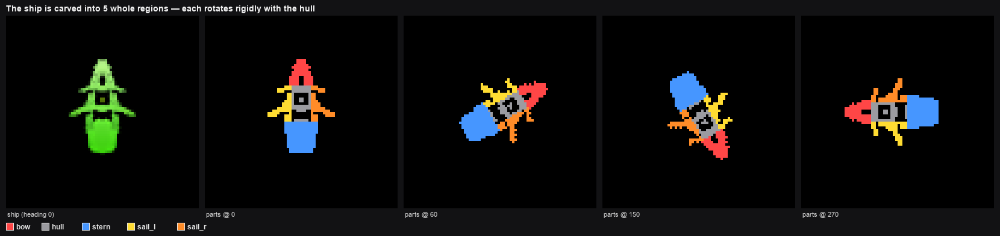
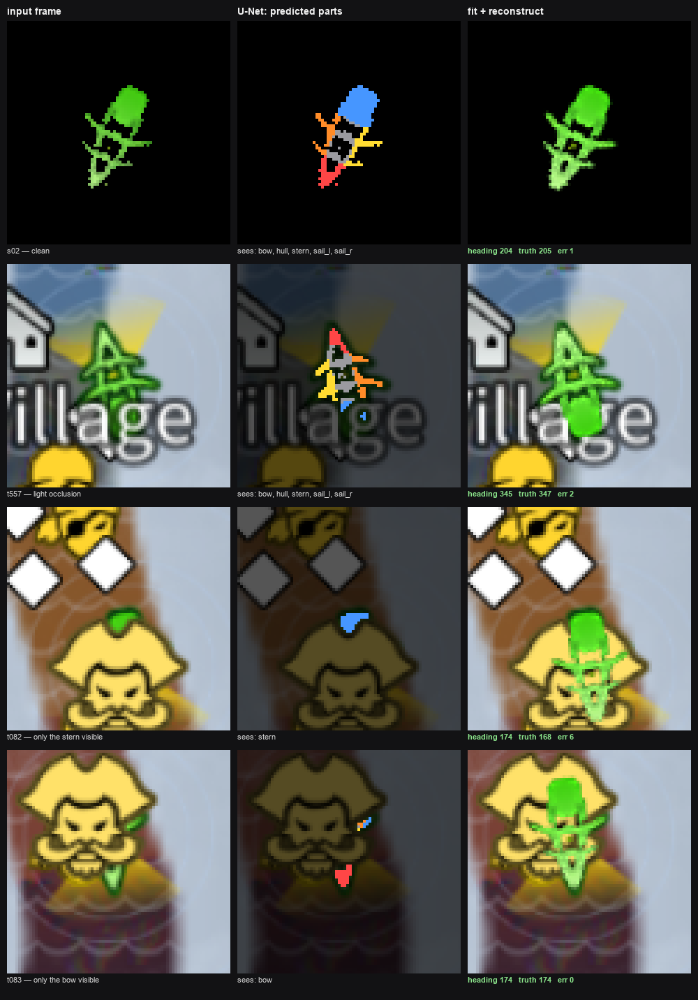

# ship_parts

Recover a ship's **heading** from an 80×80 game frame, even when the ship is almost
entirely hidden behind a portrait, village-name text, or map icons — and reconstruct the
whole ship at that heading. Heading is `0° = up (north)`, clockwise.

Drop-in Python package. Copy the folder; no dataset, no training code.

---

## How it works

Two stages. The network **recognizes parts**; geometry **turns parts into an angle**.

```
frame ──► U-Net ──► per-pixel part labels ──► part_pose (rigid fit) ──► heading
```

### 1. The parts

The ship is carved into 5 whole regions. Each is distinctive (a bow wedge can't be
mistaken for a stern block), and all 5 rotate together as one rigid body:



### 2. The U-Net (`SegNet`, 473k params, 1.9 MB)

A small U-Net that labels **every pixel** as one of `bg, bow, hull, stern, sail_l, sail_r`:

```
encoder  80→40→20  (context: what is here)
decoder  20→40→80  (location: where exactly)
   + skip connections carry sharp early detail across, so masks align with real pixels
head     1×1 conv → 6 scores per pixel
```

Trained on **20k synthetic frames** — the clean ship rendered at a random heading with real
game occluders composited on top. Labels come free by rotating the canonical part map, so
nothing was hand-annotated. Only *visible* parts are labelled, teaching it to segment what
it can actually see. Selected by lowest heading error on the real frames, not pixel
accuracy. Training lives in [`../keypoint_model/`](../keypoint_model/).

### 3. The fit (`part_pose`)

The network gives masks, not an angle. `part_pose` searches all rotations for the single
rigid pose that best explains them, scoring three terms:

| term | meaning |
|---|---|
| **+ part overlap** | predicted parts match the canonical layout (recall on labels) |
| **+ green coverage** | footprint covers the *actual* visible ship pixels (recall on pixels) |
| **− open-water penalty** | footprint must **not** sit on plainly visible water (precision) |

That last term is what makes reconstructions physically consistent: a ship may hide *under*
an occluder, but not float on open water where it would have been seen.



The bottom two rows are the point — with a **single part** visible, the geometry still pins
the heading. t082 shows only a stern; t083 only a bow.

---

## Use

```python
import numpy as np
from PIL import Image
from ship_parts import ShipHeading

est = ShipHeading()                       # load once
img = np.asarray(Image.open("frame.png").convert("RGB"))   # uint8 (80,80,3) RGB

r = est(img)
r.heading      # float degrees, 0 = up/north, clockwise
r.shift        # (dy, dx) ship placement
r.parts_seen   # e.g. ['bow']
r.labels       # (80,80) uint8 part ids
r.probs        # (6,80,80) float32 probabilities

recon = est.reconstruct(img, r)           # (80,80,3) uint8 — pass r, or it re-estimates
```

Options: `ShipHeading(device="cpu", step=3, model_path=..., canonical_path=...)`.

**Input contract** — wrong shape raises, but these fail *silently*:
- **RGB** channel order (convert if you're using OpenCV, which gives BGR)
- **80×80 uint8**, raw frame — normalization happens inside
- ship at the game's fixed scale, roughly centered

## Accuracy & speed

On the 21 labelled frames: **0.7°** mean on clean, **6.1°** mean on occluded, **9/9** within 20°.

```
init         ~60 ms   (once — builds the rotation cache)
per frame    ~39 ms   = 10 ms U-Net + 29 ms pose fit
reconstruct  ~0.4 ms  (optional; not needed for heading)
```

Defaults to **CPU** deliberately — for one 80×80 frame, MPS transfer overhead exceeds the
compute saved. `step=6` → ~27 ms; all tested values stay 9/9, and the small mean-error
differences between them are noise on a 9-image sample, not a real accuracy gain.

Each instance owns its cache, so instances are independent — don't share one across threads.

## Files

| file | |
|---|---|
| `estimator.py` | the whole implementation (net + geometry), 9 KB |
| `part_model_v1.pt` | trained weights, self-describing (`est.meta`) |
| `canonical.npz` | frozen part map + ship sprite, 2.3 KB |
| `test_smoke.py` | verifies the package still reproduces 0.7° / 6.1° / 9-of-9 |
| `make_docs.py` | regenerates the figures above |

```bash
python ship_parts/test_smoke.py     # run after touching estimator.py
```

The dataset is used **only** by `test_smoke.py`, never at inference.
